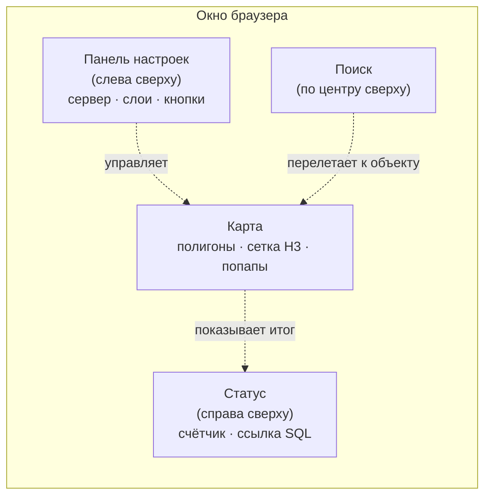
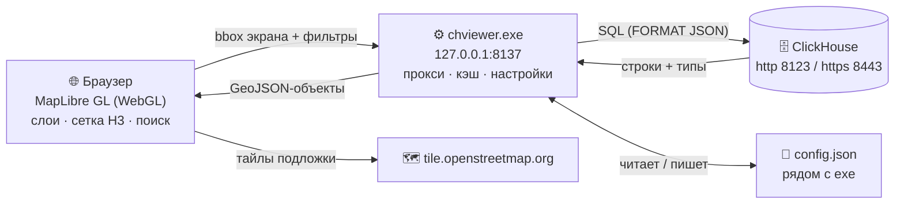
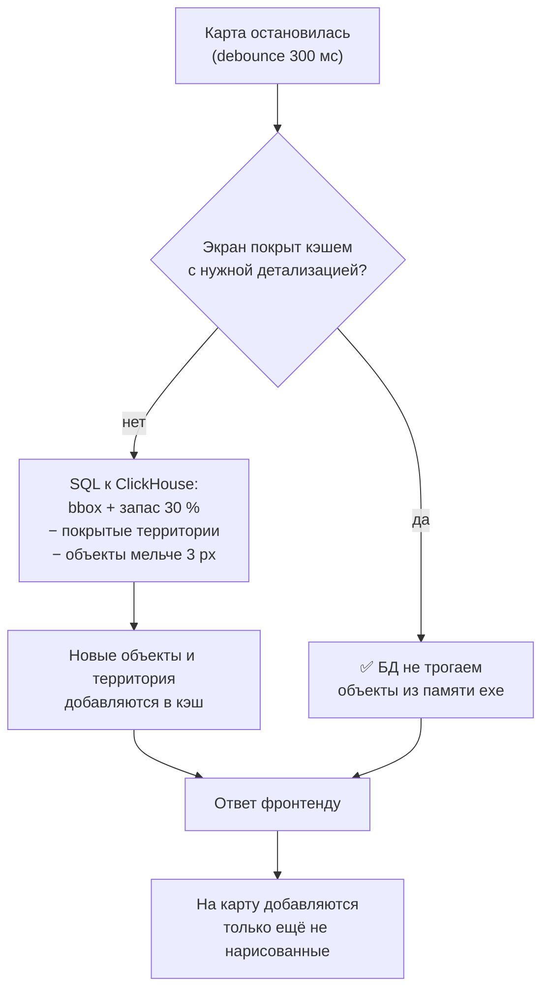
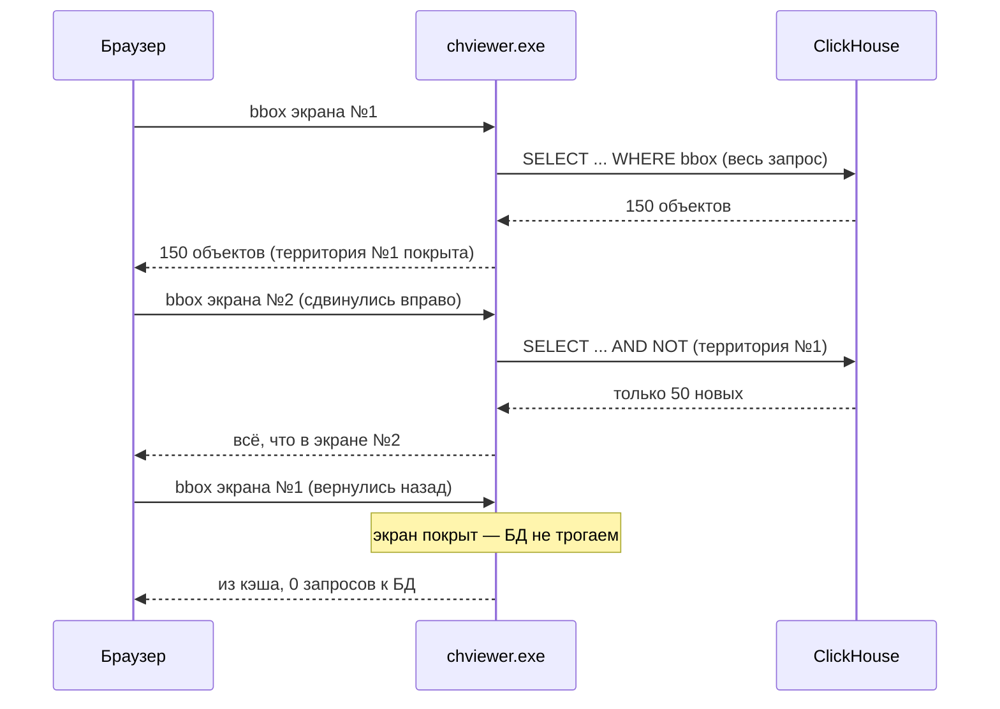
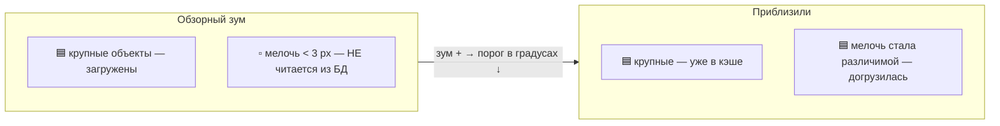
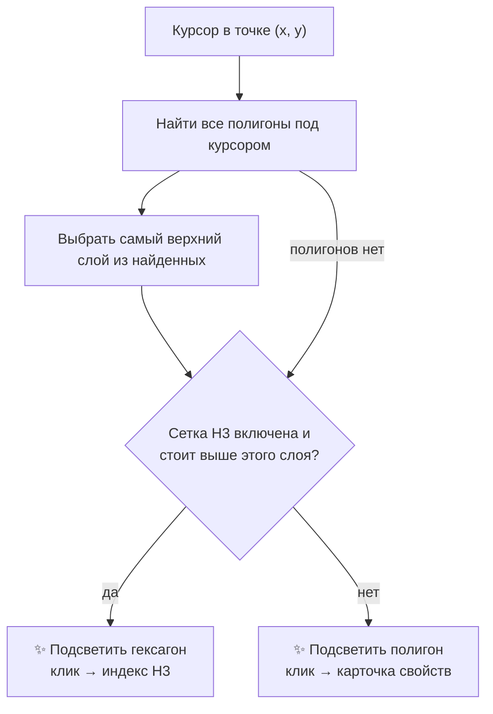
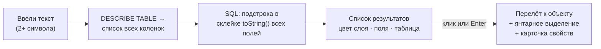
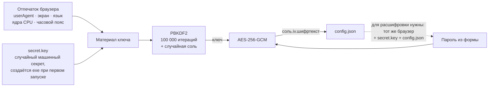
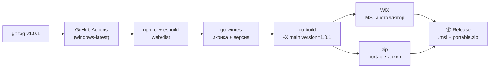

# ClickHouse Show Polygons 🗺️

[](https://github.com/akprof2000/ClickHouse-Show-Polygons/actions/workflows/ci.yml)
[](https://github.com/akprof2000/ClickHouse-Show-Polygons/actions/workflows/release.yml)
[](https://github.com/akprof2000/ClickHouse-Show-Polygons/releases/latest)
[](https://github.com/akprof2000/ClickHouse-Show-Polygons/releases)
[](LICENSE)
[](test.sh)
[](https://go.dev)
[](https://github.com/akprof2000/ClickHouse-Show-Polygons/releases/latest)
[](https://clickhouse.com)
[](https://maplibre.org)
[](https://github.com/akprof2000/Demo-H3-Hex)
[](#совсем-простой-старт)

**Один exe-файл**, который показывает полигоны из базы данных ClickHouse на карте
OpenStreetMap: скачал → запустил → ввёл адрес сервера → смотришь свои данные на карте.

Ничего устанавливать не нужно: ни Python, ни Node, ни браузерных расширений.
Внутри exe уже лежит и мини-сервер, и веб-страница с картой.

- 🚀 Рендер на GPU (MapLibre GL / WebGL) — сотни тысяч полигонов без тормозов
- 📦 Читает из БД **только то, что видно на экране** и только объекты различимого размера
- 🧠 Кэш на бэкенде: повторный просмотр области — ноль запросов к БД
- 🗂️ Сколько угодно слоёв-таблиц, у каждого свой цвет, порядок — перетаскиванием
- 🕸️ Сетка гексагонов H3 как отдельный слой (компонент [Demo-H3-Hex](https://github.com/akprof2000/Demo-H3-Hex))
- 🔍 Контекстный поиск по всем полям видимых слоёв с перелётом к объекту
- 🔐 Пароль хранится только зашифрованным (AES-256-GCM, ключ из отпечатка браузера)
- 🔒 Работает и по http (8123), и по https (8443), включая самоподписанные сертификаты

---

## Содержание

1. [Совсем простой старт — для тех, кто видит это впервые](#совсем-простой-старт)
2. [Что вы увидите на экране](#что-вы-увидите-на-экране)
3. [Как это устроено: архитектура](#как-это-устроено-архитектура)
4. [Как загружаются данные](#как-загружаются-данные)
5. [Кэш территорий](#кэш-территорий)
6. [Фильтр детализации](#фильтр-детализации)
7. [Слои и порядок отображения](#слои-и-порядок-отображения)
8. [Сетка H3](#сетка-h3)
9. [Поиск](#поиск)
10. [Как шифруется пароль](#как-шифруется-пароль)
11. [Требования к таблице](#требования-к-таблице)
12. [Сборка из исходников](#сборка-из-исходников)
13. [Тестовый стенд и автотесты](#тестовый-стенд-и-автотесты)

---

## Совсем простой старт

Инструкция для человека, который вчера впервые сел за компьютер. Серьёзно. 🙂

1. **Скачайте программу.** Справа на этой странице есть раздел **Releases** —
   нажмите на него, затем нажмите на файл
   **ClickHouse-Show-Polygons-X.Y.Z-portable.zip**. Браузер сохранит его
   в папку «Загрузки».
2. **Распакуйте и запустите.** Откройте папку «Загрузки», щёлкните по архиву
   правой кнопкой → «Извлечь всё», затем дважды щёлкните по `chviewer.exe`.
   - Windows может спросить «Вы доверяете этому файлу?» — нажмите
     «Подробнее» → «Выполнить в любом случае».
   - Появится чёрное окно с бегущими строчками — **не закрывайте его**, это и есть
     программа. Закроете окно — закроется и карта.
3. **Откроется браузер** с картой и панелью настроек в левом верхнем углу.
4. **Заполните четыре вещи:**
   - **Сервер** — адрес вашего ClickHouse. Достаточно просто IP, например `10.0.0.5`.
     Если не знаете — спросите администратора фразой «дай адрес кликхауса».
   - **Логин** и **Пароль** — от ClickHouse (не от Windows!).
   - В строке слоя — **имя таблицы** (вида `база.таблица`) и **имя колонки с полигонами**.
   - Галочка **SSL** — если сервер защищённый (тоже подскажет администратор;
     если сомневаетесь, попробуйте сначала с галочкой, потом без).
5. Нажмите **«Подключиться»**. Полигоны появятся на карте.
6. Нажмите **«Сохранить настройки»** — в следующий раз всё заполнится само.

Дальше просто пользуйтесь картой как любой онлайн-картой: колесо мыши — масштаб,
зажать и тянуть — сдвинуть, щелчок по фигуре — карточка с её данными.

---

## Что вы увидите на экране



| Элемент | Что делает |
| --- | --- |
| «Подключиться» | Проверяет таблицы и загружает видимую область |
| «Сохранить настройки» | Пишет всё в `config.json` рядом с exe; синеет, если есть несохранённые изменения |
| «Свернуть» | Прячет панель, чтобы не мешала карте |
| Ссылка **SQL** | Показывает последний запрос к БД — можно скопировать и выполнить вручную |
| Щелчок по полигону | Карточка со всеми полями строки (кроме геометрии) |
| Щелчок по гексагону | Индекс ячейки H3 в hex и int64 |

---

## Как это устроено: архитектура

Программа — это два в одном: маленький сервер на Go и веб-страница, вшитая в него.
Браузер **никогда не ходит в ClickHouse напрямую** — все запросы идут через exe.



Зачем нужен exe-посредник — он решает три проблемы, которые убивают вариант
«просто открыть HTML-файл»:

| Проблема | Как решает прокси |
| --- | --- |
| **CORS** — браузер запрещает запросы к чужому хосту | запросы идут на localhost, к ClickHouse ходит Go |
| **Самоподписанный SSL** — браузер молча блокирует | Go-клиент проверяет сертификат или пропускает по галочке |
| **Повторные запросы** — каждый сдвиг карты дёргал бы БД | кэш в памяти exe отвечает сам |

---

## Как загружаются данные

Главный принцип: **из БД читается только видимая область экрана**, с паузой 300 мс
после остановки карты и с запасом +30 % по краям, чтобы мелкие сдвиги не порождали
запросов вообще.



Границы каждого объекта считаются прямо в SQL — таблице не нужны никакие
служебные колонки:

```sql
WITH flatten(flatten(`key`)) AS pts,
     arrayMap(p -> p.1, pts) AS xs,
     arrayMap(p -> p.2, pts) AS ys
SELECT *, cityHash64(toString(`key`)) AS __id
FROM emr_ch.tbl_polygons_bmt
WHERE arrayMin(xs) <= 37.9 AND arrayMax(xs) >= 37.4      -- пересечение с экраном
  AND arrayMin(ys) <= 56.0 AND arrayMax(ys) >= 55.6
  AND NOT (...)                                           -- минус покрытые территории
  AND (arrayMax(xs)-arrayMin(xs) >= 0.0012 OR ...)        -- минус слишком мелкие
LIMIT 30000
FORMAT JSON
```

Координаты `MultiPolygon` в `FORMAT JSON` приходят готовыми вложенными массивами
`[долгота, широта]` — они без преобразований подставляются в GeoJSON.
Идентификатор объекта — `cityHash64` от геометрии, поэтому таблице не нужна
колонка-ключ.

---

## Кэш территорий

Кэш живёт в памяти exe, отдельный для каждого слоя. Хранит объекты (по хэшу
геометрии) и **покрытые территории** — прямоугольники, для которых выборка была
полной.

Исключение уже загруженного делается **территориями, а не списками id**: в SQL
добавляется по одному короткому условию на каждую покрытую область (максимум 64),
а не `NOT IN` с тысячами значений. Это корректно: объект, пересекающий полностью
загруженную область, гарантированно уже в кэше.



---

## Фильтр детализации

Тысячи «домиков» размером меньше пикселя не имеют смысла на обзорном масштабе.
Фронтенд считает, сколько градусов занимают **3 пикселя** на текущем зуме, и
передаёт порог с каждым запросом — бэкенд не читает из БД объекты мельче.



Каждая покрытая территория помнит, с какой детализацией её грузили: область,
покрытая «грубо», не считается покрытой для более детального запроса — поэтому
при приближении мелочь честно дочитывается, а повторный просмотр на том же зуме
идёт из кэша.

---

## Слои и порядок отображения

Слой — это таблица с колонкой `MultiPolygon`. Структура не фиксирована: при
подключении выполняется `DESCRIBE TABLE`, и все остальные колонки автоматически
становятся атрибутами (их показывает попап).

У каждого слоя: галочка видимости (скрытый слой **не запрашивается из БД**),
цвет (автоматически из палитры, меняется кликом), таблица, колонка геометрии.
Порядок — перетаскиванием за ручку ⣿ или стрелками; **первый в списке — верхний
на карте**. Сетка H3 — такой же слой и участвует в том же порядке.

Наведение и клик подчиняются правилу «**верхний объект побеждает**»:



---

## Сетка H3

Слой сетки — компонент [Demo-H3-Hex](https://github.com/akprof2000/Demo-H3-Hex),
подключённый git-submodule'ом (используются его не-React части: WebGL-слой
`H3GridLayer` и модуль геометрии). Ячейки **не приходят из БД** — они вычисляются
из рамки экрана, вся сетка рисуется одним draw call.

- **Разрешение** — «авто» (ребро ~40 px на любом зуме) или фиксированное 5–11.
  Пункты, дающие больше 60 000 ячеек на текущем масштабе, автоматически гаснут
  с пометкой «приблизьте карту».
- **Клик по ячейке** показывает индекс в двух видах: hex (`8711aa636ffffff`)
  и int64 (`608296725861367807`) — второй удобен для join'ов в ClickHouse,
  где H3-индексы обычно лежат как `UInt64`.
- Цвет и толщина линий настраиваются в строке слоя.

---

## Поиск

Поле по центру сверху. Ищет **по всем полям** таблиц (без учёта регистра),
но **только в видимых слоях**. Как работает:



Геометрия при поиске по сети не гоняется — только атрибуты и рамка объекта для
перелёта; сам полигон догружается штатным механизмом при перемещении карты.

---

## Как шифруется пароль

Пароль ClickHouse **никогда не хранится открытым текстом**. В `config.json`
попадает только шифртекст.



Три уровня защиты: случайная **соль** на каждое шифрование, **отпечаток браузера**
и случайный **машинный секрет** `secret.key`, который exe генерирует при первом
запуске. Знать схему шифрования недостаточно: без файла секрета с конкретной
машины и того же браузера ключ не восстановить. Шифрование выполняется в браузере
(WebCrypto); exe видит только шифртекст. В лог пароль не попадает никогда.

> 💡 Для просмотрщика заведите в ClickHouse отдельного read-only пользователя
> с доступом только к нужным таблицам.

---

## Требования к таблице

Единственное требование — колонка типа `MultiPolygon` с координатами
`(долгота, широта)`. Все остальные колонки — любые, они автоматически станут
атрибутами объекта. Пример:

```sql
CREATE TABLE emr_ch.tbl_polygons_bmt
(
    `key`          MultiPolygon,             -- геометрия
    `filial`       Int8,                     -- дальше — что угодно
    `avtocod`      Int8,
    `bmt`          UInt64,
    `filial_name`  LowCardinality(String),
    `avtocod_name` LowCardinality(String),
    `bmt_name`     LowCardinality(String)
)
ENGINE = TinyLog;
```

Движок не важен: работает и с `TinyLog`, и с `MergeTree`. Для очень больших
таблиц `MergeTree` с индексом по координатам ускорит серверную часть выборки.

---

## Сборка из исходников

Нужны: Go 1.23+, Node.js 18+, git.

```bash
git clone --recursive https://github.com/akprof2000/ClickHouse-Show-Polygons
cd ClickHouse-Show-Polygons
cd web && npm ci && cd ..
bash build.sh          # соберёт web/dist и chviewer.exe с версией из файла VERSION
```

`--recursive` обязателен: сетка H3 подключена submodule'ом
([Demo-H3-Hex](https://github.com/akprof2000/Demo-H3-Hex)), код не дублируется.

Структура проекта:

```
├── main.go                  # бэкенд: сервер, прокси, кэш территорий, поиск
├── web/
│   ├── app.js               # фронтенд: карта, слои, панель, поиск
│   ├── index.html           # каркас страницы и стили
│   └── vendor/Demo-H3-Hex/  # submodule: сетка H3
├── build.sh                 # сборка фронта + exe
├── test.sh                  # 25 автотестов
├── testenv/setup.sql        # тестовые таблицы для стенда
├── VERSION                  # версия, вшивается в exe
└── .github/workflows/release.yml   # релиз по тегу или вручную
```

## Релизы

Релиз собирается GitHub Actions — только под Windows. Есть два способа запуска.

**По тегу** (как раньше):

```bash
git tag v1.0.3 && git push origin v1.0.3
```

**Вручную, без тега** — вкладка **Actions** → workflow **release** → **Run workflow**.
Поле «Версия» можно оставить пустым: тогда версия берётся из файла `VERSION`,
а тег `vX.Y.Z` создаётся самим релизом. То же самое из консоли:

```bash
gh workflow run release.yml                 # версия из файла VERSION
gh workflow run release.yml -f version=1.0.3   # или явно
```

В релиз попадают два файла:

- **ClickHouse-Show-Polygons-X.Y.Z.msi** — инсталлятор (WiX): ставит программу
  без прав администратора, создаёт ярлыки в меню «Пуск» и на рабочем столе —
  вариант для обычных пользователей;
- **ClickHouse-Show-Polygons-X.Y.Z-portable.zip** — портативный вариант:
  внутри `chviewer.exe`, README и лицензия; работает из любой папки без установки.

У exe своя иконка и версия в свойствах файла (go-winres).



---

## Тестовый стенд и автотесты

Для разработки есть одноразовый стенд в Docker: ClickHouse с http (8123) и
https (8443, самоподписанный сертификат), две тестовые таблицы с разной
структурой (200 + 80 полигонов в районе Москвы, кириллические атрибуты).

```bash
# сертификат для https-порта
openssl req -x509 -newkey rsa:2048 -keyout testenv/server.key -out testenv/server.crt \
  -days 365 -nodes -subj "//CN=localhost"

# контейнер
docker run -d --name ch-test -p 8123:8123 -p 8443:8443 \
  -e CLICKHOUSE_PASSWORD=test123 \
  -v "$PWD/testenv/ssl.xml:/etc/clickhouse-server/config.d/ssl.xml:ro" \
  -v "$PWD/testenv/server.crt:/etc/clickhouse-server/certs/server.crt:ro" \
  -v "$PWD/testenv/server.key:/etc/clickhouse-server/certs/server.key:ro" \
  clickhouse/clickhouse-server:latest

# тестовые данные
docker exec -i ch-test clickhouse-client --password test123 --multiquery < testenv/setup.sql

# 25 автотестов: http/https, кэш, bbox, фильтр детализации, поиск, кириллица, ошибки
bash test.sh
```

---

## Лицензия

MIT. Тайлы OpenStreetMap — по их [Tile Usage Policy](https://operations.osmfoundation.org/policies/tiles/):
для серьёзного продового трафика подставьте своего тайл-провайдера.
