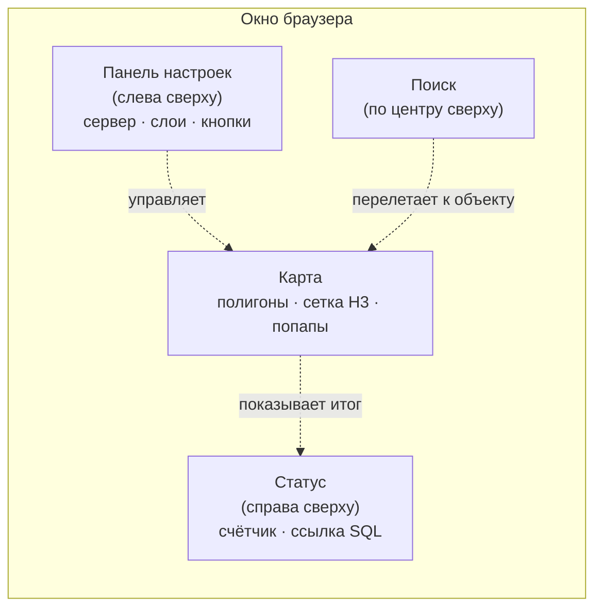
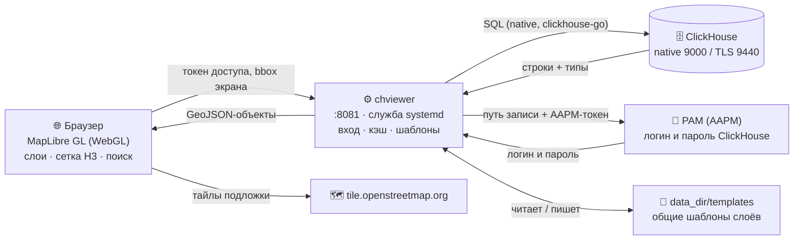
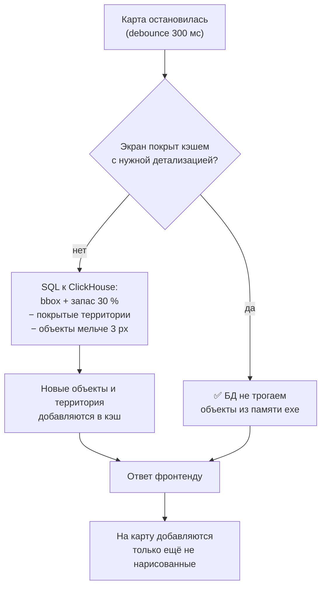
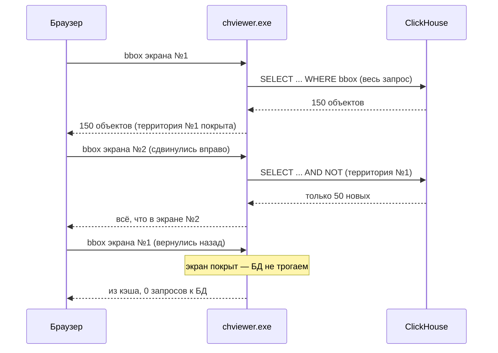
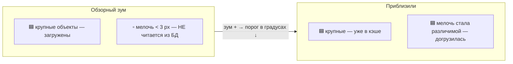
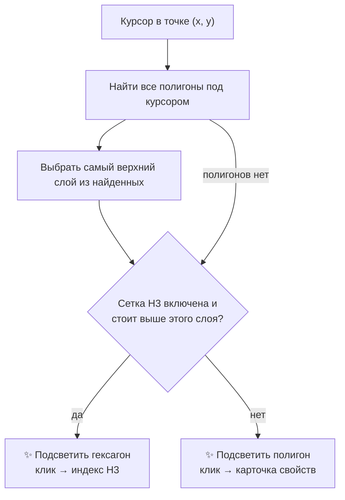
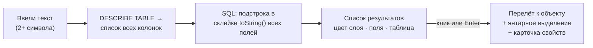
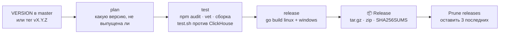

# ClickHouse Show Polygons 🗺️

[](https://github.com/akprof2000/ClickHouse-Show-Polygons/actions/workflows/ci.yml)
[](https://github.com/akprof2000/ClickHouse-Show-Polygons/actions/workflows/release.yml)
[](https://github.com/akprof2000/ClickHouse-Show-Polygons/releases/latest)
[](https://github.com/akprof2000/ClickHouse-Show-Polygons/releases)
[](LICENSE)
[](test.sh)
[](https://go.dev)
[](https://github.com/akprof2000/ClickHouse-Show-Polygons/releases/latest)
[](https://clickhouse.com)
[](https://maplibre.org)
[](https://github.com/akprof2000/Demo-H3-Hex)
[](https://github.com/akprof2000/pam-client)

**Веб-сервер**, который показывает полигоны из базы данных ClickHouse на карте
OpenStreetMap: администратор разворачивает службу, пользователи открывают её в
браузере, один раз вводят токен доступа — и работают со своими данными.

Логин и пароль ClickHouse пользователи не вводят и не видят: сервер получает их
из PAM (Privileged Access Management) по протоколу AAPM и держит у себя. Настройки
слоёв тоже живут на сервере — как общие шаблоны, доступные всем сразу.

- 🚀 Рендер на GPU (MapLibre GL / WebGL) — сотни тысяч полигонов без тормозов
- 📦 Читает из БД **только то, что видно на экране** и только объекты различимого размера
- 🧠 Кэш на сервере: повторный просмотр области — ноль запросов к БД, и он общий для всех
- 🗂️ Сколько угодно слоёв-таблиц, у каждого свой цвет, порядок — перетаскиванием
- 🕸️ Сетка гексагонов H3 как отдельный слой (компонент [Demo-H3-Hex](https://github.com/akprof2000/Demo-H3-Hex))
- 🔍 Контекстный поиск по всем полям видимых слоёв с перелётом к объекту
- 🔑 Вход по токену доступа: спрашивается один раз, дальше живёт в cookie
- 🔐 Учётные данные ClickHouse — из PAM, с кэшем и подхватом смены пароля
- 🗂️ Общие шаблоны слоёв: собрал набор — им сразу пользуются коллеги
- 🐧 Служба systemd для CentOS 9 / RHEL 9, один статический бинарник

---

## Содержание

1. [Развёртывание на CentOS](#развёртывание-на-centos)
2. [Настройка: serve.sh и chviewer.yaml](#настройка-servesh-и-chvieweryaml)
3. [Вход и учётные данные](#вход-и-учётные-данные)
4. [Подложки карты](#подложки-карты)
5. [Общие шаблоны слоёв](#общие-шаблоны-слоёв)
6. [Что вы увидите на экране](#что-вы-увидите-на-экране)
7. [Как это устроено: архитектура](#как-это-устроено-архитектура)
8. [Как загружаются данные](#как-загружаются-данные)
9. [Кэш территорий](#кэш-территорий)
10. [Фильтр детализации](#фильтр-детализации)
11. [Слои и порядок отображения](#слои-и-порядок-отображения)
12. [Сетка H3](#сетка-h3)
13. [Поиск](#поиск)
14. [Требования к таблице](#требования-к-таблице)
15. [Сборка из исходников](#сборка-из-исходников)
16. [Тестовый стенд и автотесты](#тестовый-стенд-и-автотесты)

---

## Развёртывание на CentOS

Нужен один статический бинарник — ни Go, ни Node, ни библиотек на сервере не требуется.

```bash
# 1. Забрать релиз и распаковать
curl -LO https://github.com/akprof2000/ClickHouse-Show-Polygons/releases/latest/download/ClickHouse-Show-Polygons-<версия>-linux-amd64.tar.gz
tar xzf ClickHouse-Show-Polygons-*-linux-amd64.tar.gz && cd chviewer-*-linux-amd64

# 2. Положить на место
sudo useradd -r -s /sbin/nologin chviewer
sudo mkdir -p /opt/chviewer /var/lib/chviewer
sudo cp chviewer /opt/chviewer/
sudo chown -R chviewer:chviewer /var/lib/chviewer

# 3. Конфигурация (пример с комментариями создаётся самой программой)
/opt/chviewer/chviewer -init -config ./chviewer.yaml
sudo cp chviewer.yaml /etc/chviewer.yaml

# 4. Секреты — только в окружении, не в конфиге
printf 'CHVIEWER_TOKEN=токен-доступа
PAM_TOKEN=aapm-токен
' | sudo tee /etc/chviewer.env
sudo chmod 600 /etc/chviewer.env

# 5. Служба
sudo cp chviewer.service /etc/systemd/system/
sudo systemctl daemon-reload && sudo systemctl enable --now chviewer
sudo systemctl status chviewer

# 6. Открыть порт
sudo firewall-cmd --permanent --add-port=8081/tcp && sudo firewall-cmd --reload
```

Проверить конфигурацию, не поднимая службу:

```bash
/opt/chviewer/chviewer -config /etc/chviewer.yaml -check
```

Команда сходит в PAM, подключится к ClickHouse и либо скажет «конфигурация в
порядке», либо назовёт, что именно не так.

Дальше открываете `http://сервер:8081/`, вводите токен доступа — и работаете.

---

## Настройка: serve.sh и chviewer.yaml

Настраивать можно двумя способами, как и в проекте mrr2h3.

**Через `serve.sh`** — удобно для стенда и первого знакомства. Скрипт лежит рядом
с бинарником: правите переменные в начале файла (или передаёте их окружением) и
запускаете. При первом запуске он создаёт рядом `chviewer.yaml` из этих значений
и запускает сервер; дальше правьте уже сам YAML.

```bash
CH_ADDR=clickhouse:9000 CH_PASSWORD=секрет CHVIEWER_TOKEN=токен ./serve.sh

# или с получением логина и пароля из PAM
PAM_SERVER=https://pam.example.com PAM_TOKEN=aapm-токен PAM_SECRET=/Инфраструктура/ClickHouse/viewer CHVIEWER_TOKEN=токен ./serve.sh
```

**Через YAML** — основной способ для службы. Полный пример с комментариями
создаётся командой `chviewer -init`. Главное в нём:

```yaml
listen: ":8081"                 # адрес сервера
data_dir: "/var/lib/chviewer"   # здесь лежат общие шаблоны слоёв

auth:
  token_env: "CHVIEWER_TOKEN"   # токен доступа к странице — из окружения

clickhouse:
  addr: ["ch1.example.com:9440", "ch2.example.com:9440"]  # можно несколько
  database: "default"           # база по умолчанию: слои можно писать без префикса
  pam:
    secret: "/Инфраструктура/ClickHouse/viewer"
    server: "https://pam.example.com"
    token_env: "PAM_TOKEN"      # AAPM-токен — тоже только из окружения
    ttl: 10m                    # сколько держать полученный пароль в памяти
  tls: "ca"                     # off | on | ca | insecure
  ca_cert: ["/etc/ssl/ch-ca.pem"]
```

Блок `clickhouse` устроен так же, как в mrr2h3, включая имена полей:

| Поле | Что задаёт |
| --- | --- |
| `addr` | список `host:port` native-протокола. Порт можно не писать: 9000 без TLS, 9440 с ним. Живой узел выбирает сам драйвер |
| `database` | база по умолчанию — в слоях достаточно имени таблицы без префикса |
| `tls` | `off` — обычное соединение; `on` — TLS с системными корнями; `ca` — TLS с доверием сертификатам из `ca_cert`; `insecure` — TLS без проверки (только стенд) |
| `ca_cert` | PEM-файлы корневых сертификатов для режима `ca` |
| `tls_cert`, `tls_key` | клиентский сертификат и ключ для взаимного TLS |
| `user`, `password_env` | вход логином и паролем из переменной окружения |
| `pam` | вход через PAM: путь записи, адрес, имя переменной с AAPM-токеном, свои сертификаты и `ttl` кэша |

Несочетаемые настройки отбиваются при запуске: клиентский сертификат при
`tls: off`, режим `ca` без `ca_cert`, только один файл из пары сертификат/ключ,
`password_env` вместе с `pam.secret`.

Ни один секрет в YAML не хранится: в файле только имена переменных окружения.
Сами значения задаются в `/etc/chviewer.env`, который читает systemd.

Флаги командной строки: `-config` (путь к YAML), `-listen` (переопределить
адрес), `-init` (создать пример конфигурации), `-check` (проверить и выйти),
`-version`.

---

## Вход и учётные данные

Две разные вещи, которые легко перепутать.

**Токен доступа** — им пользователь входит на страницу. Задаётся администратором
в `auth.token_env`, спрашивается при первом открытии и дальше лежит в cookie
(`HttpOnly`, `SameSite=Strict`, на HTTPS ещё и `Secure`) месяц. Пустой токен
означает вход без пароля — так можно только в закрытом контуре.

**Логин и пароль ClickHouse** — их пользователь не вводит и не видит вовсе.
Сервер берёт их одним из двух способов:

- из PAM по пути записи (`clickhouse.pam.secret`) — приложение приходит в PAM
  со своим AAPM-токеном и получает актуальные логин с паролем;
- из конфигурации: `clickhouse.user` плюс пароль в переменной окружения,
  названной в `password_env`.

Полученные из PAM данные кэшируются на `ttl` (по умолчанию 10 минут), чтобы не
ходить в PAM на каждый запрос и не засорять журнал аудита. Если ClickHouse
отвечает «неверный пароль», кэш сбрасывается и попытка повторяется один раз —
так подхватывается плановая смена пароля без перезапуска службы.

Чего в этой схеме больше нет по сравнению с настольной версией: файла
`config.json` с паролем у пользователя, шифрования пароля отпечатком браузера и
самой возможности для браузера узнать пароль базы.

---

## Подложки карты

Список подложек задаёт администратор в конфигурации, пользователь выбирает из
него в панели; выбор запоминается в браузере, у каждого свой.

Встроенный набор (если `basemaps` не задан): OpenStreetMap, **Яндекс**,
**2ГИС**, **Google**, светлая и тёмная Carto, спутник Esri, рельеф OpenTopoMap.
Свои подложки — списком, он заменяет встроенный целиком:

```yaml
basemaps:
  - name: "Яндекс"
    tiles: ["https://core-renderer-tiles.maps.yandex.net/tiles?l=map&x={x}&y={y}&z={z}&scale=1&lang=ru_RU"]
    attribution: "© Яндекс"
    max_zoom: 20
    projection: "3395"
  - name: "Свой тайл-сервер"
    tiles: ["https://tiles.corp.local/{z}/{x}/{y}.png"]
    attribution: "Внутренний тайл-сервер"
```

### Яндекс и проекция EPSG:3395

Яндекс отдаёт тайлы в эллипсоидальном меркаторе EPSG:3395, а карта и данные —
в сферическом EPSG:3857. Если подставить такие тайлы как есть, подложка
уезжает на север: на широте Москвы — почти на 20 км по местности, на зуме 15
это около 7400 пикселей.

Поэтому источники с `projection: "3395"` перепроецируются на лету прямо в
браузере ([web/merc3395.js](web/merc3395.js)). У двух проекций одинаковая
долгота, различается только широта — значит, каждый тайл 3857 собирается
построчно: для каждой строки пикселей считается её широта, по ней находится
строка нужного тайла 3395, и она копируется. На один итоговый тайл нужно
один-два исходных, разобранные тайлы кэшируются. Сервер в этом не участвует:
тайлы идут от Яндекса браузеру напрямую, как и у остальных подложек.

Проверено на стенде: после перепроецирования ориентиры на Яндексе стоят
относительно полигонов там же, где на Google и 2ГИС.

### Про правила поставщиков

У Яндекса, 2ГИС и Google правила использования разрешают тайлы только через их
собственные API и SDK. Прямое обращение к тайл-серверам из стороннего
приложения — вопрос договорённостей владельца, а не кода: если это для вас
важно, задайте в конфигурации свой список без них.

---

## Общие шаблоны слоёв

Набор слоёв (таблица, колонка геометрии, цвета, сетка H3) сохраняется на сервере
под именем и сразу виден всем остальным. Собрал коллега удачный набор — вы
выбираете его в списке и нажимаете «загрузить».

Шаблоны общие во всём: любой вошедший может создать, изменить и удалить любой из
них. Сохранение под существующим именем обновляет шаблон, а не плодит копии.
Лежат они в `data_dir/templates` обычными JSON-файлами — их удобно положить в
резервную копию или разложить заранее при установке.

## Что вы увидите на экране



| Элемент | Что делает |
| --- | --- |
| «Показать на карте» | Проверяет таблицы и загружает видимую область |
| «Сохранить как шаблон» | Кладёт набор слоёв на сервер под именем из поля рядом; синеет, если есть несохранённые изменения |
| «загрузить» / «удалить» | Берёт или убирает общий шаблон; удаление подтверждается повторным нажатием |
| «Свернуть» | Прячет панель, чтобы не мешала карте |
| Ссылка **SQL** | Показывает последний запрос к БД — можно скопировать и выполнить вручную |
| Щелчок по полигону | Карточка со всеми полями строки (кроме геометрии) |
| Щелчок по гексагону | Индекс ячейки H3 в hex и int64 |

---

## Как это устроено: архитектура

Программа — это сервер на Go со вшитой в него веб-страницей. Браузер **никогда не
ходит в ClickHouse напрямую**: он вообще не знает ни адреса базы, ни пароля — все
запросы идут через сервер, который берёт учётные данные из PAM.



Что даёт такой посредник:

| Задача | Как решает сервер |
| --- | --- |
| **Пароль базы не должен попадать к пользователю** | учётные данные берутся из PAM и не покидают сервер |
| **CORS** — браузер запрещает запросы к чужому хосту | страница ходит только к своему серверу, к ClickHouse ходит Go по native-протоколу |
| **Самоподписанный SSL** — браузер молча блокирует | Go-клиент проверяет сертификат или пропускает по настройке |
| **Повторные запросы** — каждый сдвиг карты дёргал бы БД | кэш в памяти сервера отвечает сам, и он общий для всех |
| **Настройки у каждого свои** | шаблоны слоёв лежат на сервере и видны всем |

---

## Как загружаются данные

Главный принцип: **из БД читается только видимая область экрана**, с паузой 300 мс
после остановки карты и с запасом +30 % по краям, чтобы мелкие сдвиги не порождали
запросов вообще.



Границы каждого объекта считаются прямо в SQL — таблице не нужны никакие
служебные колонки:

```sql
WITH flatten(flatten(`key`)) AS pts,
     arrayMap(p -> p.1, pts) AS xs,
     arrayMap(p -> p.2, pts) AS ys
SELECT *, cityHash64(toString(`key`)) AS __id
FROM emr_ch.tbl_polygons_bmt
WHERE arrayMin(xs) <= 37.9 AND arrayMax(xs) >= 37.4      -- пересечение с экраном
  AND arrayMin(ys) <= 56.0 AND arrayMax(ys) >= 55.6
  AND NOT (...)                                           -- минус покрытые территории
  AND (arrayMax(xs)-arrayMin(xs) >= 0.0012 OR ...)        -- минус слишком мелкие
LIMIT 30000
```

Запрос идёт через официальный драйвер `clickhouse-go` по native-протоколу, и
`MultiPolygon` приходит типизированным значением, которое сервер раскладывает
в массивы `[долгота, широта]` для GeoJSON — ровно так, как их ждёт карта.
64-битные целые отдаются браузеру строками: в JavaScript число больше 2^53
теряет точность, а это идентификатор объекта. Сам идентификатор —
`cityHash64` от геометрии, поэтому таблице не нужна колонка-ключ.

---

## Кэш территорий

Кэш живёт в памяти exe, отдельный для каждого слоя. Хранит объекты (по хэшу
геометрии) и **покрытые территории** — прямоугольники, для которых выборка была
полной.

Исключение уже загруженного делается **территориями, а не списками id**: в SQL
добавляется по одному короткому условию на каждую покрытую область (максимум 64),
а не `NOT IN` с тысячами значений. Это корректно: объект, пересекающий полностью
загруженную область, гарантированно уже в кэше.



---

## Фильтр детализации

Тысячи «домиков» размером меньше пикселя не имеют смысла на обзорном масштабе.
Фронтенд считает, сколько градусов занимают **3 пикселя** на текущем зуме, и
передаёт порог с каждым запросом — бэкенд не читает из БД объекты мельче.



Каждая покрытая территория помнит, с какой детализацией её грузили: область,
покрытая «грубо», не считается покрытой для более детального запроса — поэтому
при приближении мелочь честно дочитывается, а повторный просмотр на том же зуме
идёт из кэша.

---

## Слои и порядок отображения

Слой — это таблица с колонкой `MultiPolygon`. Структура не фиксирована: при
подключении выполняется `DESCRIBE TABLE`, и все остальные колонки автоматически
становятся атрибутами (их показывает попап).

У каждого слоя: галочка видимости (скрытый слой **не запрашивается из БД**),
цвет (автоматически из палитры, меняется кликом), таблица, колонка геометрии.
Порядок — перетаскиванием за ручку ⣿ или стрелками; **первый в списке — верхний
на карте**. Сетка H3 — такой же слой и участвует в том же порядке.

Наведение и клик подчиняются правилу «**верхний объект побеждает**»:



---

## Сетка H3

Слой сетки — компонент [Demo-H3-Hex](https://github.com/akprof2000/Demo-H3-Hex),
подключённый git-submodule'ом (используются его не-React части: WebGL-слой
`H3GridLayer` и модуль геометрии). Ячейки **не приходят из БД** — они вычисляются
из рамки экрана, вся сетка рисуется одним draw call.

- **Разрешение** — «авто» (ребро ~40 px на любом зуме) или фиксированное 5–11.
  Пункты, дающие больше 60 000 ячеек на текущем масштабе, автоматически гаснут
  с пометкой «приблизьте карту».
- **Клик по ячейке** показывает индекс в двух видах: hex (`8711aa636ffffff`)
  и int64 (`608296725861367807`) — второй удобен для join'ов в ClickHouse,
  где H3-индексы обычно лежат как `UInt64`.
- Цвет и толщина линий настраиваются в строке слоя.

---

## Поиск

Поле по центру сверху. Ищет **по всем полям** таблиц (без учёта регистра),
но **только в видимых слоях**. Как работает:



Геометрия при поиске по сети не гоняется — только атрибуты и рамка объекта для
перелёта; сам полигон догружается штатным механизмом при перемещении карты.

---

## Требования к таблице

Единственное требование — колонка типа `MultiPolygon` с координатами
`(долгота, широта)`. Все остальные колонки — любые, они автоматически станут
атрибутами объекта. Пример:

```sql
CREATE TABLE emr_ch.tbl_polygons_bmt
(
    `key`          MultiPolygon,             -- геометрия
    `filial`       Int8,                     -- дальше — что угодно
    `avtocod`      Int8,
    `bmt`          UInt64,
    `filial_name`  LowCardinality(String),
    `avtocod_name` LowCardinality(String),
    `bmt_name`     LowCardinality(String)
)
ENGINE = TinyLog;
```

Движок не важен: работает и с `TinyLog`, и с `MergeTree`. Для очень больших
таблиц `MergeTree` с индексом по координатам ускорит серверную часть выборки.

---

## Сборка из исходников

Нужны: Go 1.26+, Node.js 22+, git.

```bash
git clone --recursive https://github.com/akprof2000/ClickHouse-Show-Polygons
cd ClickHouse-Show-Polygons
cd web && npm ci && cd ..
bash build.sh          # соберёт web/dist и chviewer.exe с версией из файла VERSION

# сборка под сервер
CGO_ENABLED=0 GOOS=linux GOARCH=amd64 go build -o chviewer .
```

`--recursive` обязателен: сетка H3 подключена submodule'ом
([Demo-H3-Hex](https://github.com/akprof2000/Demo-H3-Hex)), код не дублируется.

Структура проекта:

```
├── main.go                  # запуск: флаги, проверка конфигурации, сигналы
├── config.go                # YAML-конфигурация и пример к ней
├── pamauth.go               # логин и пароль ClickHouse из PAM (AAPM)
├── chclient.go              # клиент ClickHouse (clickhouse-go, native)
├── rows.go                  # строки драйвера -> значения для JSON и геометрии
├── server.go                # HTTP: вход, слои, поиск, шаблоны
├── templates.go             # общие шаблоны слоёв на сервере
├── cache.go                 # кэш территорий и охваты полигонов
├── web/
│   ├── app.js               # фронтенд: карта, слои, вход, шаблоны
│   ├── index.html           # каркас страницы и стили
│   └── vendor/Demo-H3-Hex/  # submodule: сетка H3
├── scripts/launch/serve.sh  # настройка и запуск, создаёт chviewer.yaml
├── scripts/systemd/         # юнит для CentOS 9 / RHEL 9
├── build.sh                 # сборка фронта + бинарника
├── test.sh                  # 40 автотестов
├── testenv/setup.sql        # тестовые таблицы для стенда
├── VERSION                  # версия, вшивается в бинарник
└── .github/workflows/release.yml   # релиз по тегу или вручную
```

## Релизы

Всё собирается в GitHub Actions — локально ничего собирать не нужно.

| Workflow | Когда | Что делает |
| --- | --- | --- |
| `build` ([ci.yml](.github/workflows/ci.yml)) | каждый push и pull request | `npm audit`, сборка под Linux и Windows, `go vet`, а затем все автотесты `test.sh` против настоящего ClickHouse в контейнере |
| `release` ([release.yml](.github/workflows/release.yml)) | смена `VERSION` в master, тег `vX.Y.Z` или кнопка | сначала те же проверки, что в `build`; только если они прошли — сборка и публикация релиза |
| `Prune releases` | после каждого релиза и раз в неделю | хранит три последних релиза, более старые удаляет |
| `Cleanup` | раз в сутки | убирает старые артефакты, кэши и журналы запусков |

**Как выпустить версию** — поменять `VERSION` и запушить:

```bash
printf '3.3.0' > VERSION && git commit -am "Версия 3.3.0" && git push
```

Тег `v3.3.0` и релиз появятся сами. Если релиз с такой версией уже есть,
workflow ничего не делает — случайно выпустить одно и то же дважды нельзя.
По-прежнему работают и ручной тег (`git push origin v3.3.0`), и кнопка
**Actions → release → Run workflow**.

В релиз попадают три файла:

- **ClickHouse-Show-Polygons-X.Y.Z-linux-amd64.tar.gz** — основной артефакт:
  статический бинарник `chviewer`, скрипт `serve.sh`, systemd-юнит, пример
  конфигурации, README и лицензия. Работает на CentOS 9 и любом другом
  дистрибутиве: внешних зависимостей нет;
- **ClickHouse-Show-Polygons-X.Y.Z-windows-amd64.zip** — тот же сервер под
  Windows, для локального запуска и отладки;
- **SHA256SUMS.txt** — контрольные суммы, чтобы проверить скачанное на сервере:

```bash
sha256sum -c SHA256SUMS.txt --ignore-missing
```



## Тестовый стенд и автотесты

Для разработки есть одноразовый стенд в Docker: ClickHouse с native (9000) и
native+TLS (9440, самоподписанный сертификат), две тестовые таблицы с разной
структурой (200 + 80 полигонов в районе Москвы, кириллические атрибуты).

Проверить работу именно в серверном окружении можно там же, в контейнере
CentOS — так отлаживалась и текущая версия:

```bash
CGO_ENABLED=0 GOOS=linux GOARCH=amd64 go build -o dist-linux/chviewer .
cp scripts/launch/serve.sh dist-linux/
docker run -d --name chviewer -p 8081:8081   -e CH_ADDR=host.docker.internal:9000 -e CH_PASSWORD=test123   -e CHVIEWER_TOKEN=токен -e DATA_DIR=/var/lib/chviewer   --add-host=host.docker.internal:host-gateway   -v "$PWD/dist-linux:/opt/chviewer" -w /opt/chviewer   quay.io/centos/centos:stream9 ./serve.sh
```

```bash
# сертификат, контейнер ch-test с native 9000 и native+TLS 9440, тестовые данные
bash testenv/up.sh

# 40 автотестов: вход по токену, PAM/конфигурация, кэш, bbox, поиск, общие
# шаблоны, режимы TLS с сертификатами, защита от межсайтовых запросов, ошибки
bash test.sh
```

Тот же скрипт и те же тесты гоняет GitHub Actions на каждый push.

---

## Лицензия

MIT. Тайлы OpenStreetMap — по их [Tile Usage Policy](https://operations.osmfoundation.org/policies/tiles/):
для серьёзного продового трафика подставьте своего тайл-провайдера.
